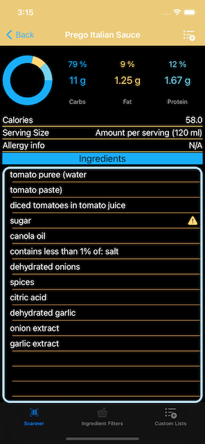
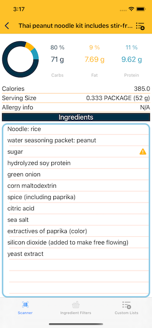
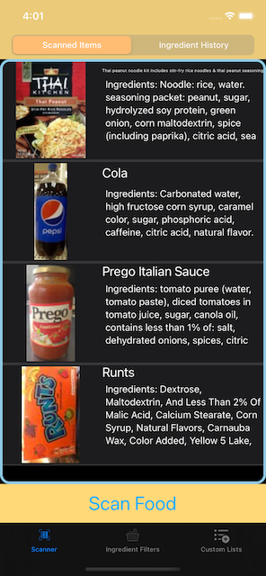
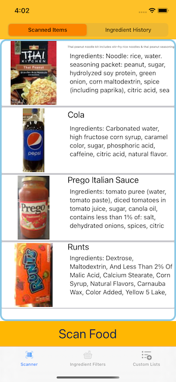
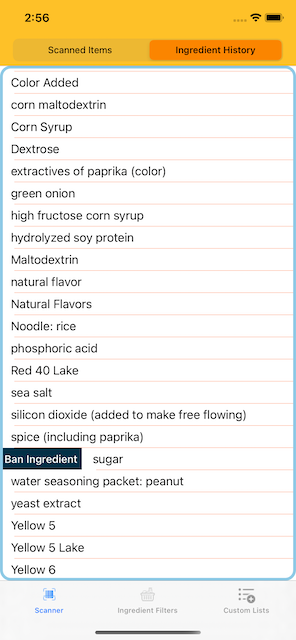
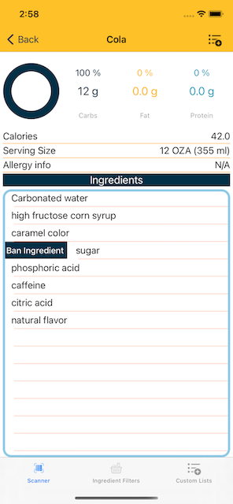
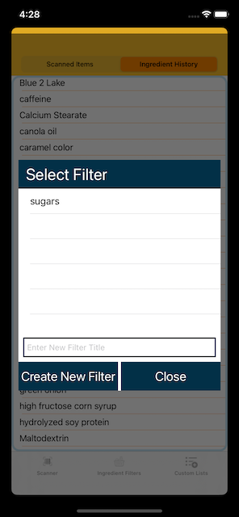
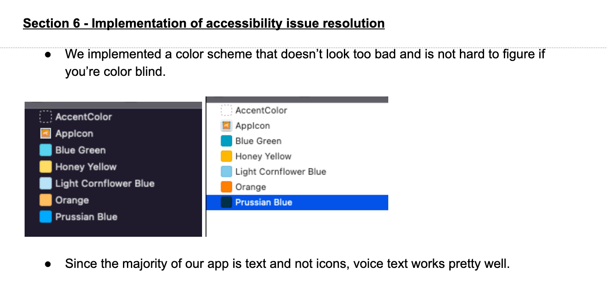

# Smart Shopper Mobile Application

# Group 5 Final App Review

Please use the `smartShopper.xcworkspace` to open the project. You might have to run `pod install` in your root dir. The app requirest cocoa pods.

In this project we focused on writing clean, well documented code that could meet product quality. We have given you demo data (please ignore the `/TODO` they're there to remove the demo data during app submission), you're free to scan more food on your own, but it will require an iPhone.

The app works on iPhones and iPad in vertical or horizontal views. Throughout the document, the screenshots are varied between `Light Mode` and `Dark Mode` to display the view working under different conditions.

## Novelty/Creativity of App Concept

Having a user account for any and everything is becoming a very annoying problem; not everyone wants their personal data to be shared with internet giants such as Google or Facebook. Not everyone wants to have a password and username for every app on their phone. This app was designed to keep the users' data on their devices safe and secure. The app is only dependent on an API which is free and improving everyday, so without even updating the app, it will be improved just because the database is being updated regularly with more food and more information.

The user is able to scan foods and see their nutritional information. Additionally, users are allowed to add filters helping them make shopping decisions must faster. As you can see in the product information below, both have caution symbols for added sugars, one of the `Filters` a user can add to quickly view key ingredients.

|         Prego (Dark Mode)         |       Noodles (Light Mode)       |
| :-------------------------------: | :------------------------------: |
|  |  |

We also saved scanned information giving the user the freedom to view their scanned item history and nutritional information about their food. This allows the user to see the history of the food they have scanned and gives them the ability to directly add any item to a grocery list.

|                Food Scan history (Dark Mode)                 |                 Food Scan history (Light Mode)                  |               User Adding food to customList (Light Mode)               |            Grocery list (Light Mode)             |
| :----------------------------------------------------------: | :-------------------------------------------------------------: | :---------------------------------------------------------------------: | :----------------------------------------------: |
|  |  | .png) | .png) |

Similar to how a user is able to add any food they scan to a `Custom List` (an example shown above as a `Grocery list`), the user can easily add ingredients to filters, either from a `scanned food` or through the `Ingredient History`.

|                Adding Ingredient to filter form History (Light Mode)                |               Adding Ingredient from Scanned Food (Light Mode)               |     Custom Alert Box To allow user to add filter  (Light Mode)      |
| :---------------------------------------------------------------------------------: | :--------------------------------------------------------------------------: | :-----------------------------------------------------------------: |
|  |  |  |

Many actions such as looking up food information and downloading pictures are done locally on the devices using the `DispatchQueue`, leaving the UI smooth and free of lag.

## Utility

Everything the user does is persisted in `Core Data`. This way, all of the user's personal information is safe on their device. There is no barrier to entry - the user does not have to make any accounts; they simply have to download the app and scan any food. This app is fantastic for people with dietary restrictions and/or allergies, since they can scan a food they would like to try and see if it has ingredients they cannot consume.

One good point about the app is that it is very low maintenance on the developer's side. It is also not dependent on the management of user databases. Almost everything the app can do is delivered and done locally on the phone.

## Optimization

We tried our best to use dispatch queue where ever necessary to create a lag free smooth experience. Care was taken with the realization that as the user scans more food and uses the app for a long time the move processing the app will have to do so we have tried to cleanly use the dispatch queue where ever it makes sense. Some places that come to mind are the `APIManger` and `download` found in `UIUtils` under the extension of `UIImageView`.

## Swifty Code

For the past two code review we have received full credit with no feedback so we assume our code is clean and written to the acceptable standards. The code is organized into different groups based on feature. We did our best to follow `swiftlint` standards, insure all views have no warning and error free constraints.  The only warnings we have are from the `cocapods` we have implemented.

### Groups

|                                                  Models                                                   |                                    UI                                    |                                                  Persistence                                                   |
| :-------------------------------------------------------------------------------------------------------: | :----------------------------------------------------------------------: | :------------------------------------------------------------------------------------------------------------: |
| Location where the json information is stored after a `fetch` `(GET)` on the database using a barcode | This is where all the `controllers`, `storyboards` and `UIUtilities` are. | This is where all CoreData objects including `PersistenceHelper` allow the user to access core data with ease. |

There're some outstanding files such as `Utils` which are global methods for the project and `APIManager` which allows anyone to make `fetches` `(GET)`.
## Framework Usage

We use shared images, colors, custom storyboards to create a clean user experience. This can be viewed under `Assets.xcassets`.
View the ```UIUtils``` or ```Utils``` files for more reusable code.
`APIManager` and `PersistenceHelper` are singletons to allow the user and developer to access critical information they need.

## Error-free

After E2E and user testing we believe we have produced an error free mobile app. We left demo data in there for your testing, so please don't mark off for the ```TODO:``` they're just there to remind me to remove them before submitting the app to the app store. We completed several end to end tests runs of our app throughout its development and implemented fixes based off user feedback from external user testing.

## User Experience

The app makes sure each view uses the similar gestures to make sure if the user does not action in one view it will be the same for another. The app has a minimalist action set to insure users are not buried under views or overwhelmed by actions.

## IOS Feel
*1. Content Prioritization*

- Following the ideal of less is more. We reuse icons to quickly teach the user of what they mean and do no try to overload the user by blasting them with information.

*2. Make Navigation Intuitive*

- All view use a `pushViewController` to make sure the user muscle memory on every different view is the same. Also nothing is berried more then at most 2 views on the stack.

*3. Touchscreen Target Sizes*

- We tried to make sure no matter in what view, landscape or portrait the user can read all information quickly and easily.

*4. Hand Position Controls*

- The `consistency` of using the `pushViewControllers` and having buttons at the same location for every `navigation` view we ensure the user can navigate the app using muscle memory.

*5. Minimize Data Input*

- In reality the only data inputs the user has is either scanning food or coming up with filters/list names. Other then that adding ingredients to filters or food to lists is done for the user by a simple few taps.
## Consistency

Using global extensions and a unified color scheme we were able to create one cohesive app. All tables and table actions
follow the same actions so once the user does one they know they can reproduce the same action in another view. One example is the ability to ban ingredients by swiping right in the ```ingredients history``` and in food ```ingredients``` list after a scan.
This also applies for deleting items from a list.

|                  Ingredient History                   |            Scanned ingredient             |
| :---------------------------------------------------: | :---------------------------------------: |
|  |  |

## User Interface

We created a unified color scheme, which is color blind friendly (this is true, we picked our colors during `Checkpoint 5: Making apps for Everyone` ), and not to flashy.

## Accessability

This covers it.



## Communication and Links


- Will will be using Discord for Team Communication and Paired Programming Sessions
     * Team tagups are Tuesdays at 7pm and Saturday at 4pm
     * Pair programming session between developers and testers can be scheduled outside of these hours using Discord
- Work tracking will be done using our [Trello Board](https://trello.com/b/twaSIpBf/mobile-app)
- Mocking will be done using our [NinjaMock account](https://ninjamock.com/Designer/Workplace/143346418/Page1)

## [UX Design Principles](http://uxbert.com/10-mobile-ux-design-principles/#.YClryHlMEuU)
**Principles should be followed whenever possible while Mocking.  Please use link for more detail**

*1. Content Prioritization*

*2. Make Navigation Intuitive*

*3. Touchscreen Target Sizes*

*4. Provide User Control*

*5. Legible Text Content*

*6. Make Interface Elements Clearly Visible*

*7. Hand Position Controls*

*8. Minimize Data Input*

*9. Create a Seamless Experience*


## Project Features
### Core
- **Barcode Scanning**
- **Ingredient Filters**
     * Sugar Limitations
	 * Allergies
	 * Dietary Restrictions
	 * Custom Addition
- **Custom Lists** (*Groceries*)
### Secondary Features
- **Banned Food List**
- **Ingredient History**
- **Food Scanned History**
### R&D Features
- **Ingredient Information Lookup**
- **Add iCloud Sync of users information**
- **Food Grading System**
- **Beauty Product Barcode Scanning**
	* Beauty Ingredients Look Up
- **Suggestion for Healthier Alternatives**
- **Filter Suggestions**
- **Food scanning without barcode**

### Development Notes

**Since we're using pods please open the project using `smartShopper.xcworkspace` to open the project for xcode**


### Acknowledgement

API Used: [Open Food Facts](https://world.openfoodfacts.org/data)

#### Pods Used

- [BarcodeScanner](https://github.com/hyperoslo/BarcodeScanner)
- [SwiftLint](https://github.com/realm/SwiftLint)
